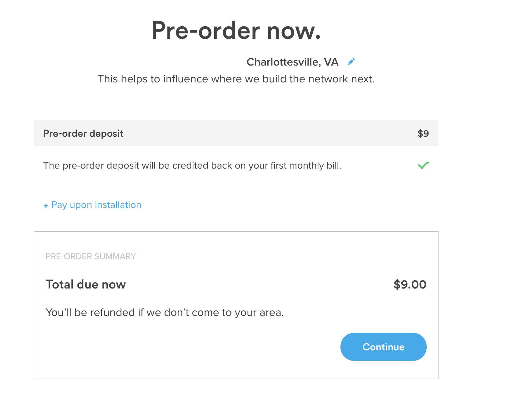

# Charlottesville - Ting Mapping

### Overview
Ting offers Fiber Internet to some residents of Charlottesville, Va. They do not currently have a map that displays which homes are available to get their service and those that are not. They do, however, have an [online tool](https://ting.com/internet/town/charlottesville) that can be used to check individual addresses. Therefore, it is difficult to compare neighborhoods or look at broader distributions of access throughout the city. This map aims to provide that insight for a very specific time stamp of Ting's availability; that time being September 27-29, 2021 as that is when the data was scraped.

### Access
* You can play around with an online [Interactive Map](https://benfrye.github.io/TingMappingProject/index.html)
* If you want to pull the data into ArcGIS or QGIS or some other GIS tool the raw data is provided in various forms in this repo
	* [Shape Files](GISData/ShapeFiles)
	* [GeoJSON Files](GISData/GeoJSON)
* The raw data used to build the GIS map data is provided in [CSV form](https://github.com/benfrye/TingMappingProject/tree/main/GISData/RawCSVs)

### Methodology
_**Note:**_ The data in this repository was scraped using Ting's [online availability checker](https://ting.com/internet/town/charlottesville) as a source. The scrape began on **September 26, 2021** and ran until **September 29, 2021**. _**Therefore, the data only accurately describes the state of Ting's availability as they claimed it to be during that time.**_

#### Sources
* City map data was used from Charlottesville's [OpenData Portal](https://opendata.charlottesville.org/). The specific data used has been snapshotted and pulled into this repo to reflect the state of the data at the time of the processing.
* Ting's availability data was scraped using a [script](GISData/Scripts/tingScraper.py) that was pointed at their [online tool](https://ting.com/internet/town/charlottesville).

#### Scraping
##### Tooling
* [Python](https://www.python.org/) - Used for running the scraping script
* [Selenium](https://selenium-python.readthedocs.io/) - Used for automating Chrome/Web Browser interactions

##### Algorithm
1. Data from the OpenData Portal's [Master Address Table](GISData/RawCSVs/Master_Address_Table.csv) is used to create a list of addresses to search.
	* The address is concatenated using the various address pieces into a format that can be input into Ting's tool
2. Using Selenium, a Chrome window is launched
3. It then navigates to Ting's [online tool](https://ting.com/internet/town/charlottesville). 
4. The first address in the list is entered 
5. The tool checks the response page to determine if Ting is currently available
	* If the words `Ting Internet is ready` or `You are ready for Ting Internet` are on the page, we can say that Ting is **AVAILABLE** for this location

	* If the words `Pre-order now` are on the page, we can say that Ting is **UNAVAILABLE** for this location.

	* _**Note: Any other page state is not handled and the address is marked UNKNOWN STATE in such an event**_
6. Once the state is determined it is added to the location data gathered from the OpenData Portal's address table and recorded to [rawScraped.csv](GISData/RawCSVs/rawScraped.csv)
7. The bot hits the `back` button in the Chrome Window
8. The page navigates back to the address entry screen and steps 4-7 are repeated for the next address
9. The bot churns through each address.
10. If the bot fails or the script needs to be halted, due to saving each address off as it goes, the bot is able to restart the process where it left off.

#### Mapping
##### Tooling
* [QGIS](https://qgis.org/en/site/) - A free GIS tool
	* [QGIS2Web](https://github.com/tomchadwin/qgis2web) - A QGIS plugin used to export the map as a Web Map
* [Leaflet](https://leafletjs.com/) - A Javascript library used for displaying the map and GIS layers in a web page
* [Github Pages](https://pages.github.com/) - Used for hosting the online map

##### Algorithm
Once the scraping tool finished and produced a raw CSV file. There are three scripts that take that data and produce the GeoJSON files that were dropped into QGIS to visualize the data.

_[geoJSONParser.py](GISData/Scripts/geoJSONParser.py)_
1. This script uses the [Master Address Points](GISData/RawCSVs/Master_Address_Points.csv) data from the OpenData portal to build a list of points with Lat/Lon data for each address in the city.
2. Then the script loads the [rawScraped.csv](GISData/RawCSVs/rawScraped.csv) data
3. It then loops through each scraped data and matches the address that was used to scrape the Ting tool with the Lat/Lon coordinates from the Master Address Points file.
4. This is then combined and written out to [available.geojson](GISData/GeoJSON/available.geojson)

_[parcelParser.py](GISData/Scripts/parcelParser.py)_
5. This script loads the [Real Estate (Base Data)](GISData/RawCSVs/Real_Estate_%28Base_Data%29.csv) data from the OpenData portal into a list of parcel GPID's.
6. Then the script loads the [rawScraped.csv](GISData/RawCSVs/rawScraped.csv) data
7. It then loops through each scraped data and matches the address that was used to scrape the Ting tool with the parcel GPID from the Real Estate (Base Data) file.
8.  This is then combined and written out to [addressesMappedToParcelGPID.csv](GISData/RawCSVs/addressesMappedToParcelGPID.csv)

_[geoJSONParcelParser.py](GISData/Scripts/geoJSONParcelParser.py)_
1. This script loads the `addressesMappedToParcelGPID.csv` file generated from the previous `parcelParser.py` script into memory.
2. Then it  loads the [Parcel Boundary Area](GISData/GeoJSON/Parcel_Boundary_Area.geojson) data from the OpenData portal to build a list of parcel areas using Lat/Lon data of each segment of the parcel for each address in the city.
4. It then loops through each address in the `addressesMappedToParcelGPID.csv` and matches the GPID associated with each address with the parcel information from the Parcel Boundary Area data.
5.  This is then combined and written out to [Parcel_Boundary_Area_With_AvailabilityStates.geojson](GISData/GeoJSON/Parcel_Boundary_Area_With_AvailabilityStates.geojson)

